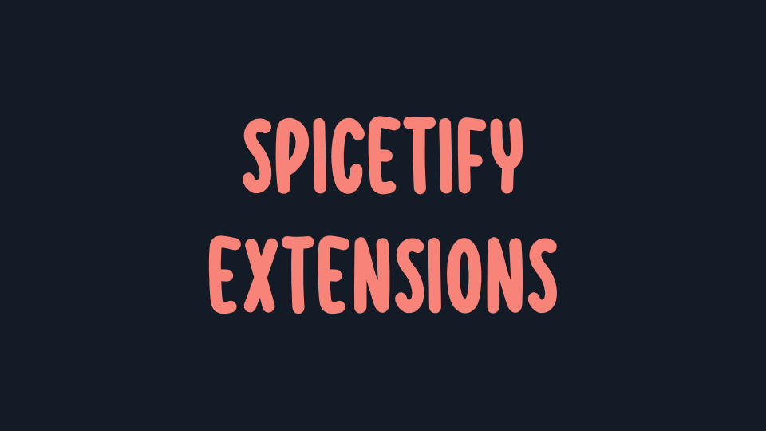

# Spicetify-Extensions

## What is this?

This is a collection of [Spicetify](https://spicetify.app/) extensions I created, written in [TypeScript](https://www.typescriptlang.org/).  

Huge thanks to the Spicetify team for making this possible and to everyone who helped me on Discord.

## Deprecated/archived extensions

⚠️Some extensions in this repository are not maintained anymore, because I have no will to keep fixing them over and over due to Spotify's API changes and/or another extension does the same thing already
Therefore I have removed them from the marketplace, they're only kept in this repository for archiving purposes
Here's the list of deprecated extensions:
- Discography to playlist: massive Spotify API changes that required a lot of fixing -> as an alternative I recommend using [Sort Play](http://github.com/hoeci/sort-play/) which does the same (and more!)
- Remove unplayable songs: broken due to Spotify's API changes, no will to fix it

## How do I download an extension?

You have two ways to get an extension: through the marketplace or manually.  
I really recommend using the marketplace to make getting extensions easy, to keep your extensions organized and to make updating them automatic.

## Downloading an extension using the marketplace

### Installing the marketplace

First you need to make sure the marketplace is installed.  
When starting Spotify, if you see an icon that says `Marketplace` on your sidebar on the left then you're good to go.  
Otherwise follow the instructions on [Spicetify's website](https://spicetify.app/docs/getting-started) or on [Spicetify Marketplace's repository](https://github.com/spicetify/spicetify-marketplace/wiki/Installation).

### Installing an extension using the marketplace

Click on the `Marketplace` icon in your Spotify sidebar, then in the search bar search for the name of an extension by replacing `-` with spaces. For example `startup page`.  
You can also simply search up my Github name to list all of my published extensions.

## Downloading an extension manually

### Downloading an extension manually from this repository

Go in the `dist` folder of the extension you want to download, click on the file then click on the download button.

### Installing an extension manually

Follow the instructions in [Spicetify's documentation](https://spicetify.app/docs/advanced-usage/extensions/)

## Building an extension

If you want to build an extension yourself you can follow these instructions

- Clone this repository
- `cd` in the folder of the extension you want
- Run `npm i` to install all dependencies
- Follow the instructions in [Spicetify's documentation](https://spicetify.app/docs/development/spicetify-creator/building-and-testing)
